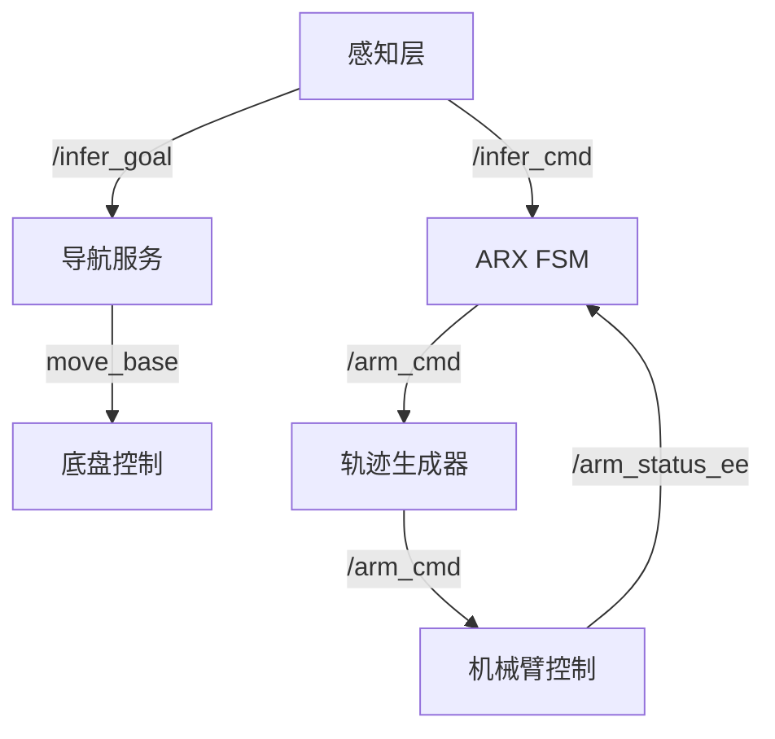

# Mobile Grasp 项目

## 1. 项目概述

Mobile Grasp 是一个集成移动底盘导航、目标检测、三维抓取点检测和机械臂控制的完整自动化系统。通过多传感器融合与深度学习算法，实现从环境感知到物体抓取的全流程自动化操作。系统采用分层架构设计（导航层、感知层、控制层），基于 ROS 框架实现各模块间的高效通信，适用于需要自主抓取任务的场景。

## 2. 主要功能


*   **实时目标检测**：采用 YOLOv8 分割模型，精准检测瓶子等目标物体

*   **3D 位置估计**：融合深度传感器信息，计算目标物体在空间中的精确坐标

*   **抓取点生成**：基于 GSNet 模型生成目标物体的最优抓取位置

*   **轨迹规划**：自动生成平滑的机械臂运动轨迹，确保抓取动作稳定

*   **安全控制**：实现工作空间边界检测，配备机械臂自动复位机制

*   **系统集成**：通过 ROS 框架整合移动底盘、机械臂与感知系统，实现协同工作

*   **状态机管理**：采用有限状态机（FSM）管理系统各工作状态，保证流程有序执行

## 3. 系统架构

### 3.1 控制架构


### 3.2 状态机设计

系统通过有限状态机（FSM）管理控制流程，包含以下核心状态：


*   **INIT**：系统初始化状态，完成传感器、机械臂、底盘的初始化配置

*   **IDLE**：空闲状态，等待外部目标指令或自动检测目标

*   **GEN\_NEW\_TRAJ**：生成新轨迹状态，根据目标位置与抓取点生成机械臂运动轨迹

*   **EXECUTING**：执行轨迹状态，控制机械臂按规划轨迹完成抓取动作

## 4. 依赖安装

### 4.1 系统要求


*   操作系统：Ubuntu 20.04

*   ROS 版本：ROS Noetic

*   Python 版本：Python 3.8

*   PyTorch 版本：PyTorch 1.12+

*   CUDA 版本：CUDA 11.3+

*   依赖库：Eigen3

### 4.2 ROS 依赖安装


```
sudo apt-get install ros-noetic-moveit ros-noetic-tf2-sensor-msgs \\

ros-noetic-move-base-msgs ros-noetic-actionlib
```

### 4.3 Python 依赖安装


```
\# 安装 PyTorch 与 TorchVision（适配 CUDA 11.3）

pip install torch==1.12.1+cu113 torchvision==0.13.1+cu113 --extra-index-url https://download.pytorch.org/whl/cu113

\# 安装其他依赖库

pip install open3d opencv-python pyrealsense2 ultralytics
```

## 5. 编译指南

### 5.1 创建工作空间


```
\# 创建工作空间目录

mkdir -p \~/mobile\_grasp\_ws/src

cd \~/mobile\_grasp\_ws/src

\# 克隆项目仓库（替换 \<repository-url> 为实际仓库地址）

git clone \<repository-url>
```

### 5.2 编译项目


```
\# 进入工作空间根目录

cd \~/mobile\_grasp\_ws

\# 编译项目

catkin\_make

\# 激活工作空间环境

source devel/setup.bash
```

## 6. 使用指南

### 6.1 启动完整系统


```
\# 授予启动脚本执行权限

chmod +x mobile\_arm\_bring\_up.bash

\# 启动整个 Mobile Grasp 系统

./mobile\_arm\_bring\_up.bash
```

### 6.2 单独启动组件

#### 6.2.1 启动导航系统


```
source \~/navi/devel/setup.bash

roslaunch local\_planner navigation.launch
```

#### 6.2.2 启动机械臂控制


```
source \~/ARX\_X5-main/ROS/X5\_ws/devel/setup.bash

roslaunch arx\_x5\_controller arx\_control.launch
```

#### 6.2.3 启动感知节点


```
\# 激活 Conda 环境（若使用 Conda 管理依赖）

source \~/anaconda3/etc/profile.d/conda.sh

conda activate graspness

\# 启动目标检测节点

python aa.py

\# 启动抓取点检测节点（新终端执行）

python infer2.py
```

## 7. 节点说明

### 7.1 核心控制节点


| 节点名称                  | 功能描述            | 主要话题                                            |
| --------------------- | --------------- | ----------------------------------------------- |
| arx\_control\_node    | 主状态机节点，管理系统状态   | /infer\_cmd, /arm\_cmd, /arm\_status\_ee        |
| trajectory\_generator | 轨迹生成节点（集成于 FSM） | -                                               |
| NavService            | 导航服务节点，控制底盘移动   | /infer\_goal, /odom\_base\_link, /infer\_status |

### 7.2 感知节点


| 节点名称      | 功能描述           | 主要话题                                    |
| --------- | -------------- | --------------------------------------- |
| aa.py     | 目标检测节点（YOLOv8） | /camera/\*, /bottle\_mask, /infer\_goal |
| infer2.py | 抓取点检测节点（GSNet） | /camera/\*, /bottle\_mask, /infer\_cmd  |

## 8. 坐标系转换

系统默认采用以下矩阵实现**相机坐标系到基座标系**的转换：


```
import numpy as np

\# 相机（A）到基座（B）的转换矩阵（4x4）

R\_A2B = np.array(\[

 [ 0,  0,  1, 0.052],  # x轴转换与偏移

 [-1,  0,  0, 0.032],  # y轴转换与偏移

 [ 0, -1,  0, 0.055],  # z轴转换与偏移

 [ 0,  0,  0, 1]       # 齐次坐标

])
```

## 9. 参数配置

### 9.1 安全边界配置（轨迹生成器）

路径：`config/trajectory_generator.yaml`


```
trajectory\_generator:

 min\_x: 0.0          # x轴最小边界（米）

 max\_x: 0.5          # x轴最大边界（米）

 min\_y: -0.5         # y轴最小边界（米）

 max\_y: 0.5          # y轴最大边界（米）

 min\_z: -0.5         # z轴最小边界（米）

 max\_z: 0.5          # z轴最大边界（米）

 min\_roll: -2.1      # 滚转角最小边界（弧度）

 max\_roll: 2.1       # 滚转角最大边界（弧度）

 min\_pitch: -1.3     # 俯仰角最小边界（弧度）

 max\_pitch: 1.3      # 俯仰角最大边界（弧度）

 min\_yaw: -1.3       # 偏航角最小边界（弧度）

 max\_yaw: 1.3        # 偏航角最大边界（弧度）

 min\_gripper: 1      #  gripper最小开度

 max\_gripper: 5      #  gripper最大开度

 exp\_velocity: 0.2   # 期望运动速度（米/秒）
```

### 9.2 导航参数配置

路径：`config/navigation.yaml`


```
grasp\_radius: 0.5          # 抓取半径（目标物体周围可抓取范围，米）

max\_inactive\_time: 3.0     # 最大不活动时间（超时自动复位，秒）
```

## 10. 故障处理与恢复

系统内置多层故障恢复机制，确保稳定运行：


1.  **超时复位**：若系统 3 秒内无任何活动（如机械臂未执行动作），自动触发机械臂复位

2.  **边界检查**：实时检测机械臂位置，若超出`trajectory_generator.yaml`配置的安全边界，立即停止运动

3.  **状态监控**：FSM 实时监控系统状态，若出现异常状态（如轨迹生成失败），自动回退至 IDLE 状态

4.  **异常处理**：各模块（感知、导航、机械臂）内置异常检测，如传感器断连、目标丢失时，触发重试或报警

## 11. 性能优化


*   **推理频率控制**：目标检测与抓取点推理间隔设为 500ms，避免 CPU/GPU 过载

*   **点云采样优化**：点云数据采样至 2500 个点，平衡检测精度与计算效率

*   **轨迹平滑处理**：轨迹更新频率设为 50Hz，确保机械臂运动平滑无抖动

*   **内存管理**：定期清理 GPU 内存（尤其是 PyTorch 推理后），防止内存溢出

## 12. 可视化与调试

### 12.1 启用调试可视化

在感知节点（aa.py/infer2.py）或控制节点中设置：


```
\# 启用调试可视化（显示目标检测框、抓取点等）

DEBUG\_VIS = True
```

### 12.2 ROS 日志级别设置


```
import rospy

\# 设置 ROS 日志级别（可选：DEBUG, INFO, WARN, ERROR, FATAL）

rospy.set\_param('/log\_level', 'INFO')
```

## 13. 扩展与定制

### 13.1 添加新目标类型（如杯子、盒子）


1.  修改 `aa.py` 中 YOLOv8 模型的检测类别（更新 `classes` 参数）

2.  调整 `infer2.py` 中的抓取点检测逻辑（适配新目标的形状特征）

3.  更新导航参数（`navigation.yaml`）中的 `grasp_radius`，适配新目标尺寸

### 13.2 修改机械臂参数


1.  调整 `trajectory_generator.yaml` 中的安全边界（如 `max_x`, `max_y`），适配不同机械臂工作空间

2.  修改 FSM（`arx_control_node`）中的状态转换逻辑（如调整轨迹生成超时时间）

3.  更新抓取器控制参数（`min_gripper`, `max_gripper`），适配不同抓取器开度范围

## 14. 贡献指南

欢迎通过以下方式参与项目贡献：


1.  **提交问题**：通过 GitHub Issue 提交 bug 报告或功能建议，需清晰描述问题场景与预期结果

2.  **代码贡献**：通过 Pull Request 提交代码，需满足以下要求：

*   代码符合 ROS C++/Python 风格指南

*   新增功能需附带单元测试或演示用例

*   更新相关文档（如本 README、参数配置说明）

## 15. 许可

本项目采用 **Apache License 2.0** 开源协议，详见项目根目录下的 `LICENSE` 文件。

